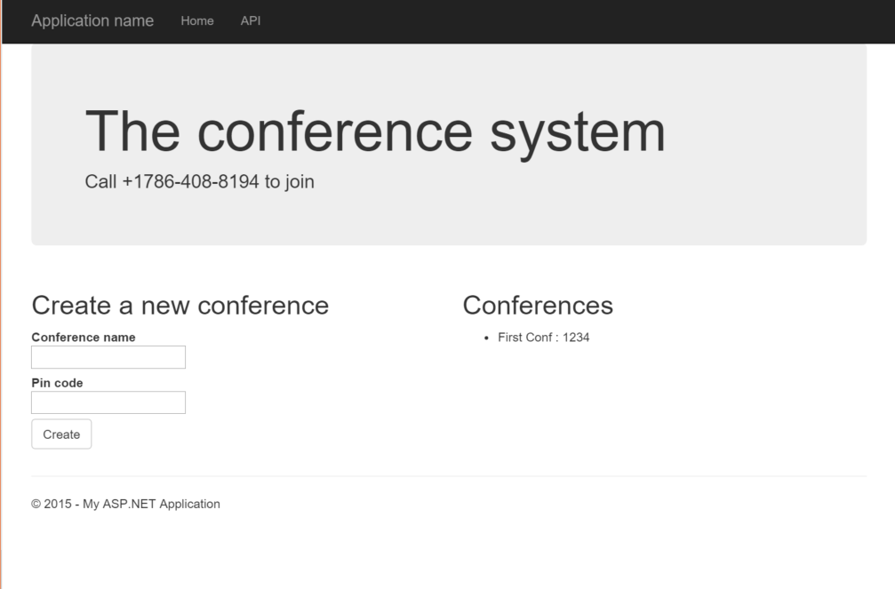
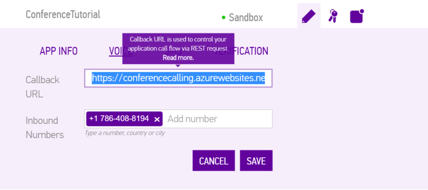
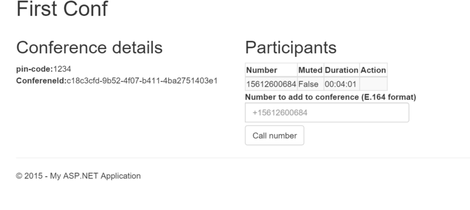

## Build you own conference calling in c#
In this tutorial we will show how easy it is to build a regular conference calling solution with both Dial in and dial out functionality. In part 2 and part 3 we will add VoIP clients to the mix. 


## Prerequisites 
1. Sinch account and an Voice enabled number https://www.sinch.com/dashboard#/numbers
2. Some cash on your account
3. A MVC project with WebAPI enabled project


## The Data model
In this tutorial we are going to use the Code first EF as our persistence layer, for my conferencing system I want to be able to give out a phone number together with a pin code to the people I want to join. And to be able to keep track of my conferences I want to give them a name. Pretty straight forward data model, create a file and call it ConferenceModels.cs and add below , also set the max length to 4 (we only want to respont to 4 digit codes in this example). For a production app you would need to ensure that the pincode is also unique but we wont worry about that here. 
```csharp
public class Conference {
	public int Id { get; set; }
    public string ConferenceName { get; set; }
	[MaxLength(4)]
    public string PinCode { get; set; }
    public Guid ConferenceId { get; set; }
}
```
To store this info later and use it in my callbacks we need a datacontext with a default connection (for more info on EF code first check out this tutorial https://www.asp.net/mvc/overview/getting-started/getting-started-with-ef-using-mvc/creating-an-entity-framework-data-model-for-an-asp-net-mvc-application)

```csharp
public class ConferenceContext : DbContext {
        public DbSet<Conference> Conferences { get; set; }
        public ConferenceContext() : base("DefaultConnection") {
        }
    }
```
and dont forget to add a connection string
```xml
  <connectionStrings>
    <add name="DefaultConnection" connectionString="Data Source=server,1433;Initial Catalog=conferencecalling;User Id=username;Password=pwd" providerName="System.Data.SqlClient" />
  </connectionStrings>
```

Next in Package Manager Console run 
```
pm>Enable-Migrations
```   
Open Migrations\Configuration.cs and set `AutomaticMigrationsEnabled = true;`
In pm run 
```
pm>Update-Database
```
## Creating a conference
Great, with this out of the way we can save conferences, open HomeController.cs and add an action called Create, no calling is goin on now, so we are just saving this for future usage. 
 
```
public async Task<RedirectToRouteResult> Create(Conference model) {
	using (var db = new ConferenceContext()) {
        // lets add a new guid to the model to ensure that all conferences are uniq
		model.ConferenceId = Guid.NewGuid();
        //save it
        db.Conferences.Add(model);
    	await db.SaveChangesAsync();
    }
    //return to home controller
	return RedirectToAction("Index");
}
```
Done, next we want to give the Index action of our system all current conferences so in Index action change it to look like this
```
public ActionResult Index() {
    using (var db = new ConferenceContext())
    {
        var model = db.Conferences.ToList();
        return View(model);
    }
}
```

## UI
We want our our home view to show a list of current conferences and the ability to start a new conference. So get rid of all the code and add the following in Views/Home/Index.cshtml

```html
@model List<ConferenceCalling.Models.Conference>
<div class="jumbotron">
    <h1>The conference system</h1>
	<p>Call +1786-408-8194 to join</p>
</div>
<div class="row">
    <div class="col-md-6">
        <h2>Create a new conference</h2>
        <p>
			@using (Html.BeginForm("Create", "Home", FormMethod.Post)) {
                <label>
                    Conference name<br />
                    <input type="text" name="ConferenceName" />
                </label><br />
                <label>
                    Pin code<br />
                    <input type="number" name="PinCode" />
                </label><br />
                <input class="btn btn-default" type="submit" value="Create" />
            }
        </p>

    </div>
    <div class="col-md-6">
        <h2>Conferences</h2>
        <ul>
            @foreach (var conference in Model) {
                <li>@conference.ConferenceName : @conference.PinCode</li>
            }
        </ul>
    </div>ld a list here later *@
    </div>
</div>
```
Run it, create a conference and you page should now look like this:


Thats it for admin page, next step is to add the callbacks to enable people to connect to the conference. 

## Callback controller
Create a new API controller and call it **CallbackController** install our brand new ServerSDK nuget in PM 

```nugetgithub
pm> Install-Package Sinch.ServerSdk 
```
To read more about this awesome package go here [https://github.com/sinch/nuget-serversdk](https://github.com/sinch/nuget-serversdk)

Next is to implement the callback, what we are going to build here is a small IVR system where the user enters the code and we will connect the caller to the right conference. That means that first we need to play a menu on Incoming Call Event (ICE) and then react to when a user enter a code. 
```csharp
  [HttpPost]
public async Task<SvamletModel> Post(CallbackEventModel model) {
    var sinch = SinchFactory.CreateCallbackResponseFactory(Locale.EnUs);
    var reader = sinch.CreateEventReader();
    var evt = reader.ReadModel(model);
    var builder = sinch.CreateIceSvamletBuilder();
    switch (evt.Event) {
		// 1: Incoming call
        case Event.IncomingCall:
            builder.AddNumberInputMenu("menu1", "Enter 4 digits", 4, "Enter 4 digits", 3, TimeSpan.FromSeconds(60));
            builder.RunMenu("menu1");
            break;
		// 2: menu input
        case Event.PromptInput:
            using (var db = new ConferenceContext()) {

                var conference = db.Conferences.FirstOrDefault(c => c.PinCode == model.MenuResult.Value);
                if (conference != null)
                {
                    builder.ConnectConference(conference.ConferenceId.ToString());
                } else {
                    builder.Say("Invalid code").Hangup(HangupCause.Normal);
                }
            }

            break;
        case Event.AnsweredCall:
            builder.Continue();
            break;
        default:
            break;
    }
    return builder.Build().Model;
}
```
First you look at what type of event is coming in, and based on that you 1. Play a menu and wait for input. When you get that input, look it up in the database and connect to that conference. 

## Configure your app
Go to your dashboard, and assign a number that your rent, and configure the URL for the Voice for the app you created 


Deploy and take it for test spin.

## Manage Conference Participants
Another cool eature we have is to lits the participants in a conference and manage their mic and even kick them out. Lets start by listing everyone in a conference, in home controller add an action called details. 
```csharp
public async Task<ActionResult> Details(int id) {
    var model = new ConferenceDetailsViewModel();
    //1. First fetch the conference details form the database.
    using (var db = new ConferenceContext())
    {
        var conference = db.Conferences.FirstOrDefault(c => c.Id == id);
        if (conference != null)
            model.Conference = conference;
    }
    // Get participants from Sinch
    // 1. Create an api factory
    var sinch = SinchFactory.CreateApiFactory(yourkey, secret);
    // 2. Get a ConferenceApi client
    var conferenceClient = sinch.CreateConferenceApi();
    //fetch the conference 
	try
	{
    var r = await conferenceClient.Conference(model.Conference.ConferenceId.ToString()).Get();
    // store the participants in the result model
    model.Participants = r.Participants;
	}
	catch (Exepction)
	{
		//do nothing, just means no one is in the conference
 		model.Participants = new IParticipant[0];
	}
    return View(model);
}
```
### Add UI
Add a view with the following elements, dont worry about the form, we will come to that. 
```html
@model ConferenceCalling.Models.ConferenceDetailsViewModel
<h1>@Model.Conference.ConferenceName</h1>
<div class="row">
    <div class="col-md-4">
        <h2>Conference details</h2>
        <b>pin-code:</b>@Model.Conference.PinCode<br />
        <b>ConfereneId:</b>@Model.Conference.ConferenceId<br />
    </div>
    <div class="col-md-8">
        <h2>Participants</h2>
        <table class="table-responsive table-bordered table-striped">
            <thead>
                <tr>
                    <th>Number</th>
                    <th>Muted</th>
                    <th>Duration </th>
                    <th>Action</th>
                </tr>
            </thead>
            @foreach (var participant in @Model.Participants) {
                <tr>
                    <td>
                        @participant.Cli
                    </td>
                    <td>@participant.Muted</td>
                    <td>@TimeSpan.FromSeconds(participant.Duration)</td>
                    <td>@* Todo *@</td>
                </tr>
            }
        </table>
        @using (Html.BeginForm("Callout", "Home", FormMethod.Post)) {
            <div class="input-group">
                <label>
                    Number to add to conference (E.164 format)<br />
                    <input type="tel" class="form-control" name="phonenumber" placeholder="+15612600684" />
                </label>
            </div>
            <div class="input-group">
                <input class="btn btn-default" type="submit" value="Call number" />
            </div>
        }
    </div>
</div>
```
Lets take a look at what we added to the table (What a table!). First added the CLI wich is the number someone is calling from, next we display the duration the caller has been in the conference and then we display if the caller is muted or not. After a test spin of the functioinality we will add the methods to mute and kick participants. 
 
Last enable the list in the Home/Index.cshtml to to be clickable, change the list in in **home/index.cshtml** to this
```html
<div class="col-md-6">
    <h2>Conferences</h2>
    <ul>
        @foreach (var conference in Model) {
            <li>@Html.ActionLink(conference.ConferenceName, "Details", new {id=conference.Id}): @conference.PinCode </li>
        }
    </ul>
</div>
```

Deploy, make a call to the number, enter your pin. Hit the details and you should see something like this



## Mute and Kick participants
Go back to your **Home/Details.cshtml** viewand add a couple of action links in the list of participants. one for Muting unmuting and one for kicking a participant

```html
 @foreach (var participant in @Model.Participants) {
    <tr>
        <td>
            @participant.Cli
        </td>
        <td>@participant.Muted</td>
        <td>@TimeSpan.FromSeconds(participant.Duration)</td>
        <td>
			@*New code *@
           @{
			string muteAction = (participant.Muted ? "Unmute" : "Mute");
			}
            @Html.ActionLink(muteAction, muteAction, new {id = Model.Conference.Id, conferenceId = @Model.Conference.ConferenceId, participant = participant.Id}) |
            @Html.ActionLink("Kick", "Kick", new {id = Model.Conference.Id, conferenceId = @Model.Conference.ConferenceId, participant = participant.Id})
        </td>
    </tr>
}
```
What we did here was to just check if a participant was muted or not and decided if we wanted a unmute or mute action to be added. In your home controller, add the actions Mute, Unmute and Kick. I know its a tutorial, but lets refactor a little bit as well.

So in HomeController.cs create private methods for gettings a confernce and getting a participant
```csharp
private IConference Getconference(string conferenceId) {
    // 1. Create an api factory    
	var sinch = SinchFactory.CreateApiFactory(yourkey, secret);
    // 2. Get a ConferenceApi client
    var conferenceClient = sinch.CreateConferenceApi();
    //fetch the conference and return
    return conferenceClient.Conference(conferenceId);
}

private IConferenceParticipant GetParticipant(string conferenceid, string participant) {
    // Get participant
    return Getconference(conferenceid).Participant(participant);
}
```

Now in your mute and unmute action add the following
```csharp
public async Task<ActionResult> UnMute(int id, Guid conferenceid, string participant) {
    await GetParticipant(conferenceid.ToString(), participant).Unmute();
    return RedirectToAction("Details", new { id = id });
}
public async Task<ActionResult> Mute(int id, Guid conferenceid, string participant) {
    await GetParticipant(conferenceid.ToString(), participant).Mute();
    return RedirectToAction("Details", new {id = id});
}
```
Pretty straight forward, lets add the kick functionality while we are at it
```csharp
public async Task<RedirectToRouteResult> Kick(int id, Guid conferenceid, string participant) {
    await GetParticipant(conferenceid.ToString(), participant).Kick();
    return RedirectToAction("Details", new { id = id });
}
```
Phew, that's a lot, if you managed to follow everything the complete home controller should now look like this
```chsharp
using System;
using System.Linq;
using System.Threading.Tasks;
using System.Web.Mvc;
using ConferenceCalling.Models;
using Sinch.ServerSdk;
using Sinch.ServerSdk.Calling;

namespace ConferenceCalling.Controllers {
    public class HomeController : Controller {
        public ActionResult Index() {
            using (var db = new ConferenceContext())
            {
                var model = db.Conferences.ToList();
                return View(model);
            }
        }

        public async Task<RedirectToRouteResult> Create(Conference model) {
            using (var db = new ConferenceContext()) {
                // lets add a new guid to the model to ensure that all conferences are uniq
                model.ConferenceId = Guid.NewGuid();
                //save it
                db.Conferences.Add(model);
                await db.SaveChangesAsync();
            }
            //return tohome controller
            return RedirectToAction("Index");
        }

        public async Task<ActionResult> Details(int id) {
            var model = new ConferenceDetailsViewModel();
            //1. First fetch the conference details form the database.
            using (var db = new ConferenceContext())
            {
                var conference = db.Conferences.FirstOrDefault(c => c.Id == id);
                if (conference != null)
                    model.Conference = conference;
            }

            try
            {
                var conf = await Getconference(model.Conference.ConferenceId.ToString()).Get();
                // store the participants in the result model
                model.Participants = conf.Participants;
            }
            catch (Exception)
            {
                model.Participants = new IParticipant[0];
                //do nothing, just means no one is in the conference
            }
         
            
            return View(model);
        }

        private IConference Getconference(string conferenceId) {
			// 1. Create an api factory
            var sinch = SinchFactory.CreateApiFactory(yourkey, yousecret);
            // 2. Get a ConferenceApi client
            var conferenceClient = sinch.CreateConferenceApi();
            //fetch the conference 
            return conferenceClient.Conference(conferenceId);
        }

        private IConferenceParticipant GetParticipant(string conferenceid, string participant) {
            // Get participants from Sinch
            return Getconference(conferenceid).Participant(participant);
        }

        public async Task<ActionResult> UnMute(int id, Guid conferenceid, string participant) {
            await GetParticipant(conferenceid.ToString(), participant).Unmute();
            return RedirectToAction("Details", new { id = id });
        }
        public async Task<ActionResult> Mute(int id, Guid conferenceid, string participant) {
            await GetParticipant(conferenceid.ToString(), participant).Mute();
            return RedirectToAction("Details", new {id = id});
        }

        public async Task<RedirectToRouteResult> Kick(int id, Guid conferenceid, string participant) {
            await GetParticipant(conferenceid.ToString(), participant).Kick();

            return RedirectToAction("Details", new { id = id });
        }
  
    }
}

```
Deploy, make a call to the number, enter your pin. Hit the details and you should see something like this


## Add someone to a Conference
In this sytem I also wanted to add the possibility to add a number and make a call to that person so they join the conference. Lets start with adding a view to show the details for a confernce, in the HomeController.cs add an Action called details, and start with just listing the basic info and the participants for a conference. First we need to create a ViewModel than can hold this info in ConferenceModels.cs. 
```csharp
public class ConferenceDetailsViewModel {
    public Conference Conference { get; set; }
    public IParticipant[] Participants { get; set; }
}
```

```csharp
public ActionResult Details(int id) {
    using (var db = new ConferenceContext())
    {
        var conference = db.Conferences.FirstOrDefault(c => c.Id == id);
        if (conference != null)
            return View(conference);
    }
    return RedirectToAction("Index");
}
```


Now we need to add the code to for the form action to actually call out, this introduces a new type of client called ApiFactory, it makes it super simple to make request to our API and takes care of all the signing and url etc for you. Open home controller and add a Action and name it Callout. 
